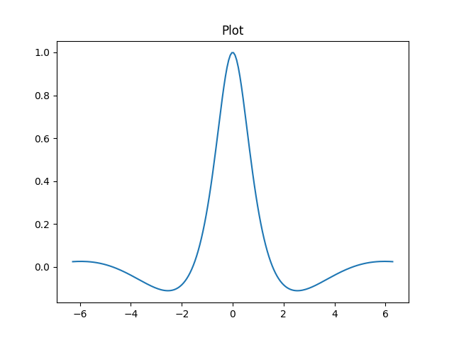

* Replacing VSCode + Jupyter with Emacs + Org Mode

Before, I would use VSCode for viewing/editing/running Jupyter notebooks. This is because ".ipynb" files are really just large JSON blocks rather than just plaintext code + output. This is annoying because I consider VSCode as a sub-par editor and I would much rather use Vim. The other issue with ".ipynb" files being JSON is that it integrates badly with ~git~. Even re-running a code block will cause a change in the ".ipynb" file by virtue of the fact that the "execution-count" field for that block has incremented and this causes a spurious diff.

I found Emacs + Org mode as a satisfactory replacement.

* Helloworld

#+begin_src python :results output 
  print("Helloworld")
#+end_src

#+RESULTS:
: Helloworld

* Minimal Emacs Configuration

The main packages you will need are

- ~org~
  - ~org-tempo~ for templating
  - ~org-babel~ for code execution
- ~pyvenv~
  - Activating virtual environments from inside Emacs

I also need Evil mode because I use Vim (btw).

~/Users/owenyi/.emacs.d/init.el~

#+begin_src elisp
;; -*- lexical-binding: t; -*-

; Package Management
(require 'package)
(add-to-list 'package-archives '("melpa" . "https://melpa.org/packages/") t)
(package-initialize)
;; Bootstrap use-package
(unless (package-installed-p 'use-package)
  (package-refresh-contents)
  (package-install 'use-package))

(require 'use-package)
(setq use-package-always-ensure t)

; json 
(require 'json)

; Theme
(use-package gruvbox-theme
  :config
  (load-theme 'gruvbox-dark-medium t))

; Basics
(setq inhibit-startup-message t)
(menu-bar-mode -1)
(tool-bar-mode -1)
(scroll-bar-mode -1)

(global-visual-line-mode 1)

(setq display-line-numbers-type 'relative)
(global-display-line-numbers-mode +1)

(fset 'yes-or-no-p 'y-or-n-p)

; Evil Mode
(setq evil-want-keybinding nil)

(use-package evil
  :ensure t
  :config
  (evil-mode 1))

(setq line-move-visual nil) ;; make gg and G more consistent

(use-package evil-collection ;; override all major modes
  :after evil
  :config
  (evil-collection-init))

(evil-ex-define-cmd "Ex" 'dired) ;; Ex -> dired

; Focus on new splits when created

(defun split-and-follow-horizontally ()
  (interactive)
  (split-window-below)
  (other-window 1))

(defun split-and-follow-vertically ()
  (interactive)
  (split-window-right)
  (other-window 1))

(global-set-key (kbd "C-x 2") 'split-and-follow-horizontally)
(global-set-key (kbd "C-x 3") 'split-and-follow-vertically)

(evil-ex-define-cmd "sp"  'split-and-follow-horizontally)
(evil-ex-define-cmd "vsp" 'split-and-follow-vertically)

; vterm

(use-package vterm
  :ensure t)

; Org mode
(use-package org
  :config
  ;; Enable syntax highlighting for code blocks
  (setq org-src-fontify-natively t)
  ;; Don't ask to confirm evaluation of code blocks
  (setq org-confirm-babel-evaluate nil)
  ;; Enable indentation
  (setq org-src-tab-acts-natively t)
  ;; Enable tempo so <s TAB> works
  (require 'org-tempo)
  ;; Add custom template for Python session blocks
  (add-to-list 'org-structure-template-alist
               '("sp" . "src python :results output :session main"))
  (add-to-list 'org-structure-template-alist
             '("spf" . "src python :results output file link :session main"))

  )

;; Enable Python in Org Babel
(with-eval-after-load 'org
  (org-babel-do-load-languages
   'org-babel-load-languages
   '((python . t)))
  (setq org-babel-python-command "python3"))  ;; or "ipython --simple-prompt -i"

(add-hook 'org-babel-after-execute-hook 'org-redisplay-inline-images) ; inline images

;; Wrap org babel python code in try except block to show traceback
(defun my/org-babel-python-evaluate
    (orig session body &optional result-type result-params preamble async
          graphics-file)
  "This is the :around advice."
  (let ((body (format "\
try:
%s
except Exception as e:
   import traceback
   traceback.print_exc()
"
                      (org-babel-python--shift-right body 3))))
    (funcall orig session body result-type result-params preamble
             async graphics-file)))
(advice-add #'org-babel-python-evaluate 
            :around
            #'my/org-babel-python-evaluate)

; pyvenv
(use-package pyvenv
  :ensure t
  :config
  (pyvenv-mode 1))

; ===

(custom-set-variables
 ;; custom-set-variables was added by Custom.
 ;; If you edit it by hand, you could mess it up, so be careful.
 ;; Your init file should contain only one such instance.
 ;; If there is more than one, they won't work right.
 '(package-selected-packages '(evil-collection gruvbox-theme ob-python pyvenv vterm)))
(custom-set-faces
 ;; custom-set-faces was added by Custom.
 ;; If you edit it by hand, you could mess it up, so be careful.
 ;; Your init file should contain only one such instance.
 ;; If there is more than one, they won't work right.
 )
#+end_src

* High Level Workflow

** Activating a Virtual Environment

Create a python virtual environment in an integrated terminal or shell e.g. with my config I can run ~:vsp~ followed by ~:vterm~ to bring up the vterm terminal emulator in a new buffer and execute ~python3 -m venv .venv~.

Activate the virtual environment with ~pyvenv~. Execute ~M-x pyvenv-activate RET location/of/your/.venv~.

** Create a Code Block

~<sp TAB~ is the shortcut I defined in my "init.el" using org-tempo to create a python code block.

#+BEGIN_EXAMPLE

#+begin_src python :results output :session main
  
#+end_src

#+END_EXAMPLE

I like to import ~sys~ and ~os~ libraries to also print the location of the python executable being used and the current working directory respectively.

#+begin_src python :results output :session main
  import sys
  import os

  print(sys.executable)
  print(os.getcwd())
#+end_src

#+RESULTS:
: /Library/Frameworks/Python.framework/Versions/3.10/bin/python3
: /Users/owenyi/Desktop/Everything_v2

** Executing Code

Execute the code block by doing ~C-c C-c~. Helpful shortcuts are listed below.

- ~C-c C-c~ to do ~M-x org-babel-execute-src-block~
- ~C-c C-v C-b~ to do ~M-x org-babel-execute-buffer~
  - equivalent of run all
- ~C-c C-v C-n~ to do ~M-x org-babel-next-src-block~
- ~C-c C-v C-p~ to do ~M-x org-babel-previous-src-block~

In Jupyter, variables are shared between blocks. Use the ~:session main~ header to achieve the equivalent behaviour. You can define multiple sessions e.g. ~:session foo~ creates another session called "foo".

** Deleting/Restarting a session

Each session creates a new buffer. Run ~M-x buffer-menu~ to bring up the buffer list. Here's an example

#+BEGIN_SRC text
CRM Buffer                    Size Mode             File
.%* *vterm*                    140 VTerm            
  * emacs_org_mode_to_replace_vscode_plus_jupyter.org    6935 Org         emacs_org_mode_to_replace_vscode_plus_jupyter.org
  * *main*                     253 Inferior Python:run 
    init.el                   3746 ELisp/l          ~/.emacs.d/init.el
 %  .emacs.d                   521 Dired by name    ~/.emacs.d/
  * *Org-Babel Error Output*       0 Compilation      
  * *scratch*                  146 Lisp Interaction 
 %* *Messages*               21150 Messages         
 %* *Async-native-compile-log*     108 elisp-compile    
  * *foo*                      530 Inferior Python:run 
#+END_SRC

- Observe the ~*main*~ and ~*foo*~ buffers which have Mode as "Inferior Python...". You can delete a session by deleting the associated buffer e.g. using ~M-x kill-buffer~.
 
** Graphics

#+begin_src python :results output :session main
  import numpy as np
  import pandas as pd
  import matplotlib as mpl
  import matplotlib.pyplot as plt

  mpl.use("Agg")
  
  from pathlib import Path
#+end_src

#+RESULTS:

#+begin_src python :results output file link :session main
  plot_folder = Path("Attachments")
  plot_folder.mkdir(exist_ok = True)
  filename = plot_folder / "emacs_org_mode_to_replace_vscode_plus_jupyter_plot.png"

  fig, ax = plt.subplots()
  ax.set_title("Plot")

  x = np.linspace(-2 * np.pi, 2 * np.pi, 200)
  y = 1/(1+x**2) * np.cos(x)
  ax.plot(x, y)
  plt.savefig(filename)
  plt.close("all")
  print(filename)
#+end_src

#+RESULTS:

#+ATTR_HTML: :alt "My plot" :width 600px

We specify ~mpl.use("Agg")~ to choose plotting backend that doesn't open up a GUI (we just the want the image saved to a file). We then specify a folder and file path to save the plot to. We then print the filename. The header ~:results file link~ converts the filename into an Org mode link (which is just text surrounded by two square brackets). Org mode follows the link and embeds the image because we added the hook in our "init.el" ~(add-hook 'org-babel-after-execute-hook 'org-redisplay-inline-images)~.

* Understanding Headers

Further reading:
- https://www.gnu.org/software/emacs/manual/html_node/org/Using-Header-Arguments.html
- https://orgmode.org/worg/org-contrib/babel/languages/ob-doc-python.html

~:session main~ creates/uses a session called "main"

If session is unspecified the following hold

- ~:results output~ tells Org mode to grab stdout and embed that in the results. As such you would need to call ~print()~ at some point to see output.
- ~:results value~ tells Org mode to wrap the code block inside a function block and embed the output of that function. As such you need a ~return~ statement at the end

If session is specified, the behaviour is slightly different. The way session works is it opens a Python REPL so instead of reading from stdout, it reads what is printed out.

~:results file link~ tells Org mode to wrap the output inside square brackets to produce an org mode link. 

* Rough Edges

** Error Messages

Trying to get error messages to be printed was a pain in the ass. The approach I settled on was to wrap each code block in a try except block.

#+begin_src python 
try:
    ...
except Exception as e:
   import traceback
   traceback.print_exc() 
#+end_src

More information: https://emacs.stackexchange.com/questions/79162/org-babel-python-code-block-not-showing-errors-during-execution

** Infinite Loops

#+begin_src python :results output :session main
  while True:
      pass
#+end_src

Infinite loops cause the entire Emacs application to freeze. Run ~C-g~ a couple times to break out of the loop.

** Indentation

The auto-indentation is a bit janky especially for multiline statements.

#+begin_src python :results output :session main
print(
"a",
"b",
"c")
#+end_src

Move cursor behind the "a" and everytime you press enter Emacs indents everything forward.

* Other Notes

Use ~C-x C-f~ to create file. When Emacs minibuffer prompt you with a default, you can clear it with ~C-a C-k~ (go to start + kill line).

** More short cuts

Switching buffers
- ~C-x <left>~ previous buffer
- ~C-x <right>~ next buffer
- ~C-x C-b~ list buffers
- ~C-x b~ switch to buffer

Jumping between headings
- ~C-c C-n~ next heading
- ~C-c C-p~ previous heading
